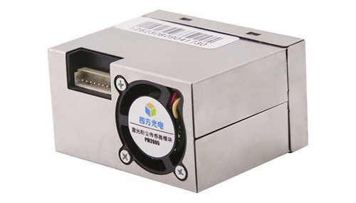

CUBIC PM2005/PM2105 Laser Particle Sensor Module
================================================

.. seo::
    :description: Instructions for setting up PM2005/PM2105 Particulate matter sensor
    :image: pm2005.png
    :keywords: pm2005, pm2105, DAIKIN BRY88AB151K, BRY88AB151K

The ``pm2005`` sensor platform allows you to use your PM2005/PM2105 laser particulate matter sensor with ESPHome.

    CUBIC PM2005/PM2105 Laser Particle Sensor Module.

The sensor communicates with the board via the :ref:`I²C <i2c>` protocol.

.. code-block:: yaml

    # Example configuration entry
    sensor:
      - platform: pm2005
        update_interval: 60s
        pm_1_0:
          name: "PM1.0"
        pm_2_5:
          name: "PM2.5"
        pm_10_0:
          name: "PM10.0"

Configuration variables:
------------------------

- **type** (*Optional*): ``pm2005`` (default) or ``pm2105``

- **update_interval** (*Optional*, :ref:`config-time`): The interval to check the sensor. Defaults to ``60s``.

- **pm_1_0** (*Optional*): Use the concentration of particulates of size less than 1.0µm in µg per cubic meter.

  - All options from :ref:`Sensor <config-sensor>`.

- **pm_2_5** (*Optional*): Use the concentration of particulates of size less than 2.5µm in µg per cubic meter.

  - All options from :ref:`Sensor <config-sensor>`.

- **pm_10_0** (*Optional*): Use the concentration of particulates of size less than 10.0µm in µg per cubic meter.

  - All options from :ref:`Sensor <config-sensor>`.

See Also
--------

- :ref:`sensor-filters`
- :apiref:`pm2005/pm2005.h`
- :ghedit:`Edit`
